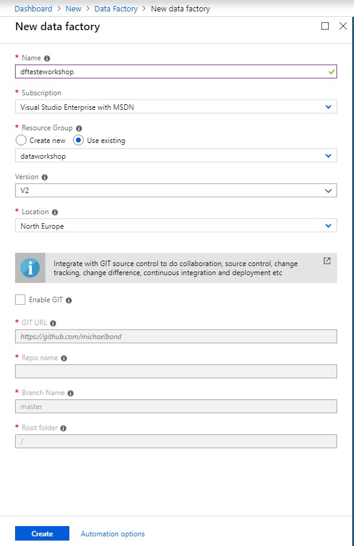
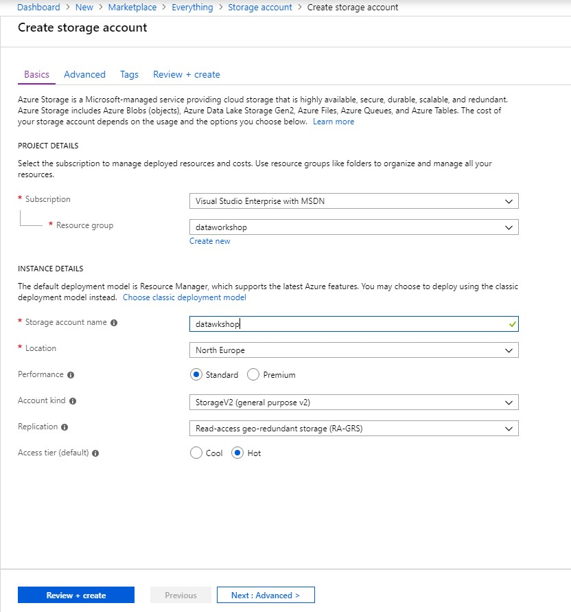
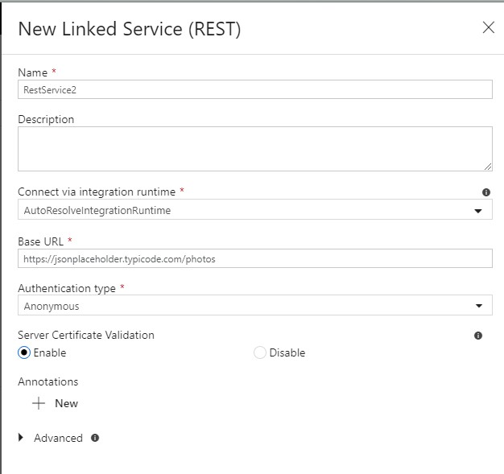
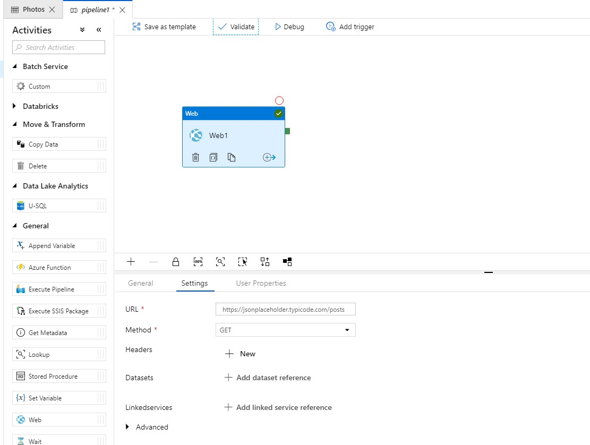
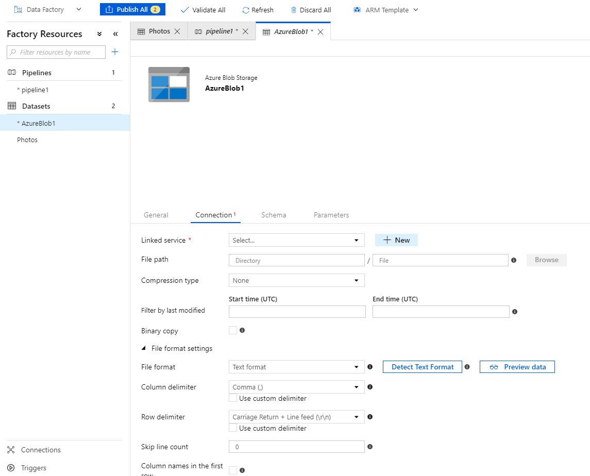
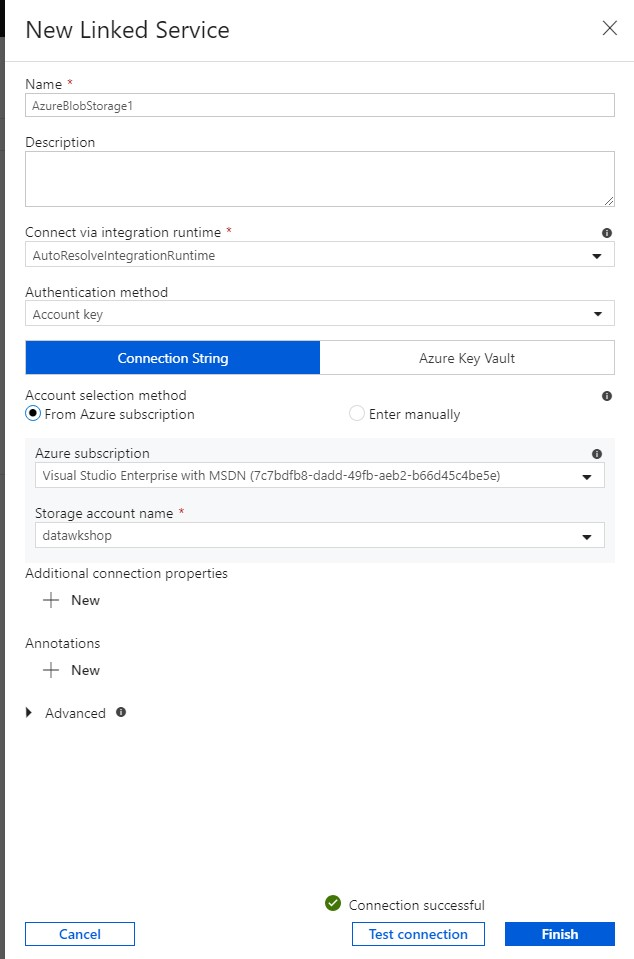

Vamos criar um DataFactory:

Vamos criar um StorageAccount (para podermos copiar para lá dados):

Criar um dataset para obtermos informação de algures:

Apontar para um link com resultados, como por exemplo:
[https://jsonplaceholder.typicode.com/posts](https://jsonplaceholder.typicode.com/posts)

Adicionar um pedido get a este URL:

Agora adicionamos um dataset para conectar à storage account:

E adicionarmos o linked service:

